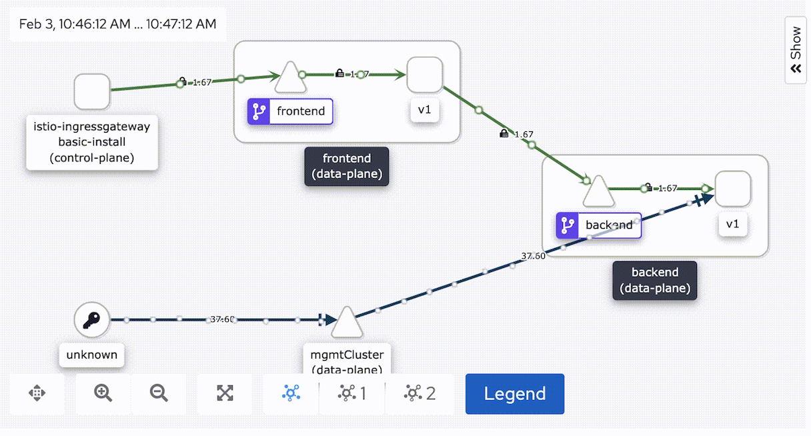
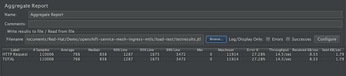
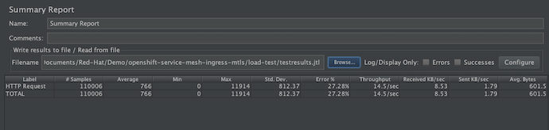
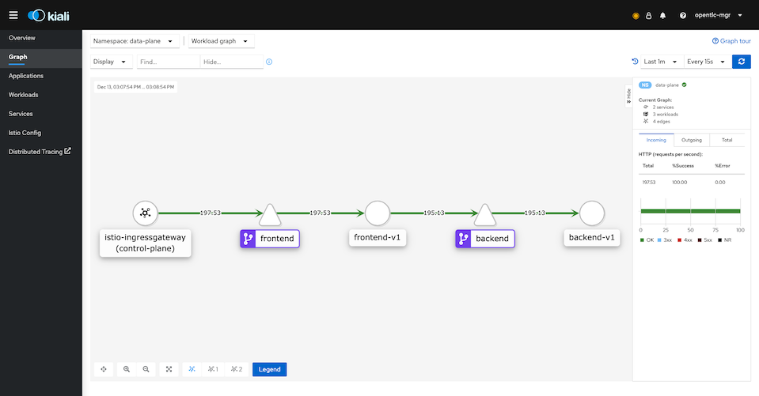
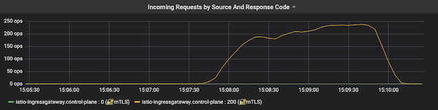

# Mutual TLS ingress gateway with OpenShift Service Mesh


<!-- TOC -->

- [Mutual TLS ingress gateway with OpenShift Service Mesh](#mutual-tls-ingress-gateway-with-openshift-service-mesh)
  - [Prerequisites](#prerequisites)
  - [Step by Step setup](#step-by-step-setup)
    - [Setup Control Plane, Data Plane and Deploy Demo Application](#setup-control-plane-data-plane-and-deploy-demo-application)
    - [Secure backend and frontend with mTLS](#secure-backend-and-frontend-with-mtls)
    - [Health Check](#health-check)
    - [Configure Gateway with TLS](#configure-gateway-with-tls)
    - [Configure Gateway with mTLS](#configure-gateway-with-mtls)
  - [Interactive Command Line setup](#interactive-command-line-setup)

<!-- /TOC -->
## Prerequisites

Prerequisites are install Operators required by OpenShift Service Mesh. You need to install following Operators from OperatorHub.

  - ElasticSearch
  - Jaeger
  - Kiali
  - OpenShift Service Mesh
  
## Step by Step setup

### Setup Control Plane, Data Plane and Deploy Demo Application
- Create control plane
  
  ```bash
  #Create namespace for control plane
  oc new-project control-plane --display-name="Control Plane"
  
  #Create control plane
  oc create -f https://raw.githubusercontent.com/voraviz/openshift-service-mesh-ingress-mtls/main/setup-ossm/smcp.yaml -n control-plane
  
  #Wait couple of minutes for operator to creating control plane
  #You can check status by
  oc get smcp basic-install -n control-plane
  ```
- Create data plane and join data plane to control plane

  ```bash
  #Create data plane project
  oc new-project data-plane --display-name="Data Plane"

  #Join data-plane namespace into control-plane
  oc create -f https://raw.githubusercontent.com/voraviz/openshift-service-mesh-istio-gateway/main/member-roll.yaml -n control-plane

  #Check ServiceMeshControlPlane
  oc describe smmr/default -n control-plane | grep Spec -A2
  ```

- Deploy sample application

  ```bash
  oc apply -f https://raw.githubusercontent.com/voraviz/openshift-service-mesh-ingress-mtls/main/apps/deployment.yaml -n data-plane
  ```
- Create Destination Rule and Virtual Service for backend
  
  ```bash
  #Create Destination Rule - backend service
  oc apply -f https://raw.githubusercontent.com/voraviz/openshift-service-mesh-ingress-mtls/main/config/backend-destination-rule.yaml
  
  #Create Virtual Service - backend service
  oc apply -f https://raw.githubusercontent.com/voraviz/openshift-service-mesh-ingress-mtls/main/config/backend-virtual-service.yaml
  ```
- Create Gateway, Destination Rule and Virtual Service for frontend
  
  ```bash
  #Get OpenShift Domain from Console's URL this default subdomain to "apps"
  SUBDOMAIN=$(oc whoami --show-console  | awk -F'apps.' '{print $2}')
  DOMAIN="apps.${SUBDOMAIN}"

  #Create Destination Rule
  oc apply -f https://raw.githubusercontent.com/voraviz/openshift-service-mesh-ingress-mtls/main/config/frontend-destination-rule.yaml

  #Create Gateway - replaced DOMAIN cluster to yaml
  curl -s  https://raw.githubusercontent.com/voraviz/openshift-service-mesh-ingress-mtls/main/config/gateway.yaml|sed 's/DOMAIN/'"$DOMAIN"'/'| oc apply -f -

  #Create Virtual Service - replaced DOMAIN cluster to yaml
  curl -s  https://raw.githubusercontent.com/voraviz/openshift-service-mesh-ingress-mtls/main/config/frontend-virtual-service.yaml| sed 's/DOMAIN/'"$DOMAIN"'/' | oc apply -f -
  ```
- Check our application on Developer Console
- Check Istio Config on Kiali Console
- Test application
  
  ```bash
  # DOMAIN is your cluster Domain
  curl http://frontend.$DOMAIN
  # Sample output
  Frontend version: 1.0.0 => [Backend: http://backend:8080/version, Response: 200, Body: Backend version:v1, Response:200, Host:backend-v1-58ff89cccc-pchmp, Status:200, Message: ]
  ```

### Secure backend and frontend with mTLS
- secure backend with STRICT mTLS

  ```bash
  oc apply -f https://raw.githubusercontent.com/voraviz/openshift-service-mesh-ingress-mtls/main/config/backend-peer-authentication.yaml
  oc apply -f https://raw.githubusercontent.com/voraviz/openshift-service-mesh-ingress-mtls/main/config/backend-destination-rule-mtls.yaml
  ```
- secure frontend with STRICT mTLS
  
  ```bash
  oc apply -f https://raw.githubusercontent.com/voraviz/openshift-service-mesh-ingress-mtls/main/config/frontend-peer-authentication.yaml
  oc apply -f https://raw.githubusercontent.com/voraviz/openshift-service-mesh-ingress-mtls/main/config/frontend-destination-rule-mtls.yaml
  ```

### Health Check
- Add health check to backend
  
  ```bash
  #Pause Rollout
  oc rollout pause deployment backend-v1 -n data-plane
  #Set Readiness Probe
  oc set probe deployment backend-v1 --readiness --get-url=http://:8080/health/ready --failure-threshold=1 --initial-delay-seconds=5 --period-seconds=5 -n data-plane

  #Set Liveness Probe
  oc set probe deployment backend-v1 --liveness --get-url=http://:8080/health/live --failure-threshold=1 --initial-delay-seconds=5 --period-seconds=5 -n data-plane

  #Resume Rollout
  oc rollout resume deployment backend-v1 -n data-plane
  ```
- Annotate backend deployment for redirect HTTP probe
  
  ```bash
  oc patch deployment/backend-v1 -p '{"spec":{"template":{"metadata":{"annotations":{"sidecar.istio.io/rewriteAppHTTPProbers":"true"}}}}}'
  ```
- Check Kiali Graph. Dark blue line on lower part of diagram is health check traffic and green line is traffic from gateway to fronend and then to backend that is secured by mTLS (lock icon)
  
  
  
- Test that pod without sidecar cannot access backend
  
  ```bash
  oc run test-station -n data-plane -i --image=quay.io/voravitl/backend-native:v1 --rm=true  --restart=Never -- curl -vs http://backend:8080

  # Sample Output
  * Rebuilt URL to: http://backend:8080/
  *   Trying 172.30.77.122...
  * TCP_NODELAY set
  * Connected to backend (172.30.77.122) port 8080 (#0)
  > GET / HTTP/1.1
  > Host: backend:8080
  > User-Agent: curl/7.61.1
  > Accept: */*
  >
  * Recv failure: Connection reset by peer
  * Closing connection 0
  pod "test-station" deleted
  ```
  
### Configure Gateway with TLS
- Create CA, Private Key and Certificate for Gateway
  - use [create-certificate.sh](scripts/create-certificate.sh)
  
    ```bash
    mkdir -p certs
    scripts/create-certificate.sh
    ```

  - Alternatively, run following command
    
    ```bash
    #!/bin/bash
    mkdir -p certs
    SUBDOMAIN=$(oc whoami --show-console  | awk -F'apps.' '{print $2}')
    CN=frontend.apps.$SUBDOMAIN
    echo "Create Root CA and Private Key"
    openssl req -x509 -sha256 -nodes -days 365 -newkey rsa:2048 -subj '/O=example Inc./CN=example.com' \
    -keyout certs/example.com.key -out certs/example.com.crt
    echo "Create Certificate and Private Key for $CN"
    openssl req -out certs/frontend.csr -newkey rsa:2048 -nodes -keyout certs/frontend.key -subj "/CN=${CN}/O=Great Department"
    openssl x509 -req -days 365 -CA certs/example.com.crt -CAkey certs/example.com.key -set_serial 0 -in certs/frontend.csr -out certs/frontend.crt
    ```

- Create secret to CA, Private Key and Cerfificate
  
  ```bash
  oc create secret generic frontend-credential \
  --from-file=tls.key=certs/frontend.key \
  --from-file=tls.crt=certs/frontend.crt \
  -n control-plane
  ```
  
- Updating [Gateway](config/gateway-tls.yaml) with TLS. Check that Gateway mTLS mode is set to SIMPLE
  
  ```bash
  SUBDOMAIN=$(oc whoami --show-console  | awk -F'apps.' '{print $2}')
  DOMAIN="apps.${SUBDOMAIN}"
  curl -s  https://raw.githubusercontent.com/voraviz/openshift-service-mesh-ingress-mtls/main/config/gateway-tls.yaml| sed 's/DOMAIN/'"$DOMAIN"'/' | oc apply -f -
  ```
- Test with cURL. Check that certificate issuer is *O=example Inc.; CN=example.com* and subject is *CN=frontend.apps.; O=Great Department*
  
  ```bash
  curl -kv https://frontend.$DOMAIN

  # Sample Output
  *   Trying 3.1.112.71...
  * TCP_NODELAY set
  * Connected to frontend.apps.cluster-ba08.ba08.example.opentlc.com (3.1.112.71) port 443 (#0)
  * ALPN, offering h2
  * ALPN, offering http/1.1
  * successfully set certificate verify locations:
  *   CAfile: /etc/ssl/cert.pem
    CApath: none
  * TLSv1.2 (OUT), TLS handshake, Client hello (1):
  * TLSv1.2 (IN), TLS handshake, Server hello (2):
  * TLSv1.2 (IN), TLS handshake, Certificate (11):
  * TLSv1.2 (IN), TLS handshake, Server key exchange (12):
  * TLSv1.2 (IN), TLS handshake, Server finished (14):
  * TLSv1.2 (OUT), TLS handshake, Client key exchange (16):
  * TLSv1.2 (OUT), TLS change cipher, Change cipher spec (1):
  * TLSv1.2 (OUT), TLS handshake, Finished (20):
  * TLSv1.2 (IN), TLS change cipher, Change cipher spec (1):
  * TLSv1.2 (IN), TLS handshake, Finished (20):
  * SSL connection using TLSv1.2 / ECDHE-RSA-AES256-GCM-SHA384
  * ALPN, server accepted to use h2
  * Server certificate:
  *  subject: CN=frontend.apps.; O=Great Department
  *  start date: Feb  3 04:46:38 2021 GMT
  *  expire date: Feb  3 04:46:38 2022 GMT
  *  issuer: O=example Inc.; CN=example.com
  *  SSL certificate verify result: unable to get local issuer certificate (20), continuing anyway.
  * Using HTTP2, server supports multi-use
  * Connection state changed (HTTP/2 confirmed)
  * Copying HTTP/2 data in stream buffer to connection buffer after upgrade: len=0
  * Using Stream ID: 1 (easy handle 0x7fcc83808600)
  > GET / HTTP/2
  > Host: frontend.apps.cluster-ba08.ba08.example.opentlc.com
  > User-Agent: curl/7.64.1
  > Accept: */*
  >
  * Connection state changed (MAX_CONCURRENT_STREAMS == 2147483647)!
  < HTTP/2 200
  < x-correlation-id: 90a41ac0-c693-4807-8684-ac9a3a153f77
  < x-powered-by: Express
  < content-type: text/html; charset=utf-8
  < content-length: 177
  < etag: W/"b1-2RNTCjZv6HdZfogo/ta6cwDM6sA"
  < date: Wed, 03 Feb 2021 04:53:47 GMT
  < x-envoy-upstream-service-time: 8
  < server: istio-envoy
  <
  * Connection #0 to host frontend.apps.cluster-ba08.ba08.example.opentlc.com left intact
  Frontend version: 1.0.0 => [Backend: http://backend:8080/version, Response: 200, Body: Backend version:v1, Response:200, Host:backend-v1-55898f64b4-pgfwk, Status:200, Message: ]* Closing connection 0
  ```

### Configure Gateway with mTLS
- Create CA, Private Key and Certificate for Client named *Acme Inc*
  - use [create-cleint-certificate.sh](scripts/create-client-certificate.sh)
  
    ```bash
    mkdir -p certs
    scripts/create-client-certificate.sh
    ```

  - Alternatively, run following command
    
    ```bash
    mkdir -p certs
    CN=great-partner.apps.acme.com
    echo "Create Root CA and Private Key"
    openssl req -x509 -sha256 -nodes -days 365 -newkey rsa:2048 -subj '/O=Acme Inc./CN=acme.com' \
    -keyout certs/acme.com.key -out certs/acme.com.crt
    echo "Create Certificate and Private Key for $CN"
    openssl req -out certs/great-partner.csr -newkey rsa:2048 -nodes -keyout certs/great-partner.key -subj "/CN=${CN}/O=Great Department"
    openssl x509 -req -days 365 -CA certs/acme.com.crt -CAkey certs/acme.com.key -set_serial 0 -in certs/great-partner.csr -out certs/great-partner.crt
    ```
- Update secret with client's CA

  ```bash
  oc create secret generic frontend-credential \
  --from-file=tls.key=certs/frontend.key \
  --from-file=tls.crt=certs/frontend.crt \
  --from-file=ca.crt=certs/acme.com.crt \
  -n control-plane --dry-run=client -o yaml \
  | oc replace -n control-plane secret frontend-credential -f -
  ```
  
- Updating [Gateway](config/gateway-mtls.yaml) with mTLS. Check that Gateway mTLS mode is set to MUTUAL
  
  ```bash
  SUBDOMAIN=$(oc whoami --show-console  | awk -F'apps.' '{print $2}')
  DOMAIN="apps.${SUBDOMAIN}"
  curl -s  https://raw.githubusercontent.com/voraviz/openshift-service-mesh-ingress-mtls/main/config/gateway-mtls.yaml | sed 's/DOMAIN/'"$DOMAIN"'/' | oc apply -f -
  ```
- Use cURL to test without client certificate
  
  ```bash
  curl -k https://frontend.$DOMAIN

  # Sample output
  curl: (35) error:1401E410:SSL routines:CONNECT_CR_FINISHED:sslv3 alert handshake failure
  ```
- Use cURL to test with *Acme Inc* certificate
  
  ```bash
  curl -k --cacert certs/acme.com.crt \
  --cert certs/great-partner.crt \
  --key certs/great-partner.key \
  https://frontend.$DOMAIN
  ```

- Create CA, Private Key and Certificate for another Client named *Pirate Inc*
  - use [create-bad-cleint-certificate.sh](scripts/create-bad-client-certificate.sh)
  
    ```bash
    mkdir -p certs
    scripts/create-bad-client-certificate.sh
    ```

  - Alternatively, run following command
    
    ```bash
    CN=bad-partner.apps.pirate.com
    echo "Create Root CA and Private Key"
    openssl req -x509 -sha256 -nodes -days 365 -newkey rsa:2048 -subj '/O=Pirate Inc./CN=pirate.com' \
    -keyout certs/pirate.com.key -out certs/pirate.com.crt
    echo "Create Certificate and Private Key for $CN"
    openssl req -out certs/bad-partner.csr -newkey rsa:2048 -nodes -keyout certs/bad-partner.key -subj "/CN=${CN}/O=Bad Department"
    openssl x509 -req -days 365 -CA certs/pirate.com.crt -CAkey certs/pirate.com.key -set_serial 0 -in certs/bad-partner.csr -out certs/bad-partner.crt
    ``` 
- Use cURL to test with *Pirate Inc* certificate. You will get error *"alert unknown ca"*
  
  ```bash
  curl -k --cacert certs/pirate.com.crt \
  --cert certs/bad-partner.crt \
  --key certs/bad-partner.key \
  https://frontend.$DOMAIN
  ```
- Business department agreed deal with *Pirate Inc* to use our frontend service then we need to update our Gateway to trust *Pirate Inc*
  - Create certificate file with both *Acme Inc* and *Private Inc*
    
    ```bash
    cat certs/acme.com.crt > certs/trusted.crt
    cat certs/pirate.com.crt >> certs/trusted.crt
    ```

  - Update frontend-credential secert
  
    ```bash
    oc create secret generic frontend-credential \
    --from-file=tls.key=certs/frontend.key \
    --from-file=tls.crt=certs/frontend.crt \
    --from-file=ca.crt=certs/trusted.crt \
    -n control-plane --dry-run=client -o yaml \
    | oc replace -n control-plane secret frontend-credential -f -
    ```
    
  - Test with cURL using *Pirate Inc* and *Acme Inc* certificate.
    ```bash
    curl -k --cacert certs/pirate.com.crt \
    --cert certs/bad-partner.crt \
    --key certs/bad-partner.key \
    https://frontend.$DOMAIN

    curl -k --cacert certs/acme.com.crt \
    --cert certs/great-partner.crt \
    --key certs/great-partner.key \
    https://frontend.$DOMAIN

    ```
  
## Interactive Command Line setup
[setup.sh](setup.sh) will automate create control plane, data plane, deploy applications and configured mTLS for all communications including ingress. 


<!-- Secure Gateways is enabled by default for OpenShift Service Mesh 2.0 (Istio 1.6) -->

```bash
./setup.sh
# Following instruction provided by bash script
```

To cleanup both control plane and data plane

```bash
./cleanup.sh
```


<!-- ## Load Test with JMeter

JMeter with preconfigred truststore and keystore JKS already prepared.

Remark: Edit [run-test.sh](load-test/run-test.sh) to specified based installation path of JMeter to environment variable JMETER_BASE_PATH

```
cd load-test
./run-test.sh $$<hostname - without https> <threads> <loops>
# Example
# ./run-test.sh frontend-data-plane.apps.example.com 200 500
```

Sample reports generated from testresult.jtl

  - Aggregate report
  
    

  - Summary report

    

Graph in Kiali Console



You can check Grafana in Control Plane project workloads

 -->


<!-- ## Pod Liveness & Readiness

```bash
oc rollout pause deployment/backend-v1 
oc set probe deployment/backend-v1 --readiness --get-url=http://:8080/health/ready --failure-threshold=1 --initial-delay-seconds=5--period-seconds=5 
oc set probe deployment/backend-v1 --liveness --get-url=http://:8080/health/live --failure-threshold=1 --initial-delay-seconds=5 --period-seconds=5 
oc rollout resume deployment/backend-v1 
oc patch deployment/backend-v1 -p '{"spec":{"template":{"metadata":{"annotations":{"sidecar.istio.io/rewriteAppHTTPProbers":"true"}}}}}'
``` -->

<!-- Kiali
oc rollout pause deployment/backend-v1 
oc patch deployment/backend-v1 -p '{"spec":{"template":{"metadata":{"annotations":{"kiali.io/runtimes":"quarkus"}}}}}'
oc patch deployment/backend-v1 -p '{"spec":{"template":{"metadata":{"annotations":{"prometheus.io/scrape":"true"}}}}}'
oc patch deployment/backend-v1 -p '{"spec":{"template":{"metadata":{"annotations":{"prometheus.io/port":"8080"}}}}}'
oc patch deployment/backend-v1 -p '{"spec":{"template":{"metadata":{"annotations":{"prometheus.io/scheme":"http"}}}}}'
oc patch deployment/backend-v1 -p '{"spec":{"template":{"metadata":{"annotations":{"prometheus.io/path":"/metrics"}}}}}'
oc rollout resume deployment/backend-v1  -->
